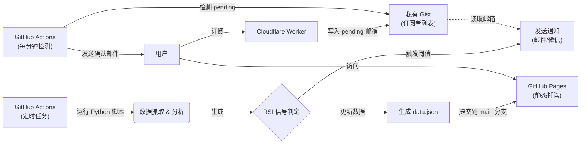

# 📈 JTrading - 红利低波ETF (512890) 智能监控系统

[](https://github.com/Pear56/JTrading/actions/workflows/rsi_check.yml)
[](https://github.com/Pear56/JTrading/actions/workflows/send_confirmation.yml)
[](https://pear56.github.io/JTrading/)
[](https://opensource.org/licenses/MIT)

**JTrading** 是一个基于 GitHub Actions 的 Serverless 自动化交易辅助系统。它专为 **红利低波ETF (512890)** 设计，能够全自动监控 RSI 技术指标，提供现代化的可视化看板，并在出现买卖信号时通过多渠道发送提醒。

---

## ✨ 核心功能

### 1. 📊 现代化可视化看板
- **环形进度仪表盘**: 采用全新的环形进度条设计，视觉焦点集中，RSI 数值一目了然。
- **动态状态反馈**: 仪表盘颜色根据 RSI 状态（超买/超卖/中性）自动变化 (绿/红/灰)。
- **响应式布局**: 基于 CSS Grid 的自适应设计，完美适配桌面大屏与移动端设备。
- **深色模式**: 支持系统级 Dark Mode，夜间查看更护眼。
- **实时数据**: 展示最新价格、RSI 数值及明确的操作建议。

### 2. 🤖 全自动智能监控
- **交易时段巡航**: 仅在 A 股交易时段 (北京时间 09:00 - 15:00) 每小时自动运行一次，节省资源。
- **数据持久化**: 每次运行自动生成静态数据文件，驱动前端页面更新，无需后端服务器。

### 3. 🔔 多渠道即时通知
- **邮件推送**: 触发买卖阈值时，发送包含详细数据的 **HTML 格式邮件**，内置取消订阅链接。
- **微信提醒**: 集成 Server酱，支持微信端即时消息推送。

### 4. 📧 全自动订阅管理
- **一键订阅**: 用户在网页填写邮箱后，自动添加到订阅列表，无需人工处理。
- **Cloudflare Worker**: 通过边缘计算处理订阅请求，秒级响应。
- **自动确认邮件**: 新订阅者在 **1 分钟内** 收到精美的 HTML 确认邮件。
- **私有 Gist 存储**: 订阅者邮箱安全存储在私有 Gist 中，支持 `#` 注释行。
- **双重保险**: 前端支持 Cloudflare Worker + Formspree 双重备份，确保订阅服务稳定。

---

## 🏗️ 系统架构

本系统完全基于免费服务构建，零服务器成本：



## 📂 项目结构

```text
trading_rsi_app/
├── .github/workflows/
│   ├── rsi_check.yml           # RSI 监控调度 (Cron: 0 1-7 * * *)
│   └── send_confirmation.yml   # 确认邮件发送 (Cron: 每分钟)
├── cloudflare-worker/
│   ├── worker.js               # Cloudflare Worker 订阅服务
│   └── wrangler.toml           # Worker 配置文件
├── docs/
│   ├── index.html              # 前端看板 (HTML5 + CSS3 + Vanilla JS)
│   └── data.json               # (自动生成) 最新监控数据
├── github_action_runner.py     # 核心脚本: 爬虫、计算、通知、生成数据
├── send_confirmation.py        # 订阅确认邮件发送脚本
├── requirements.txt            # Python 依赖库
└── README.md                   # 项目文档
```

---

## 🚀 快速部署指南 (Fork & Run)

只需简单几步，即可拥有自己的监控系统：

### 1. Fork 项目
点击右上角 **Fork** 按钮，将仓库复制到您的 GitHub 账号下。

### 2. 配置 GitHub Secrets
进入仓库 **Settings** → **Secrets and variables** → **Actions** → **Secrets**，添加以下密钥：

| Secret 名称 | 必填 | 说明 | 示例 |
| :--- | :--- | :--- | :--- |
| `SENDER_EMAIL` | ✅ | 发件人邮箱 (SMTP) | `example@126.com` |
| `SENDER_PASSWORD` | ✅ | 邮箱 SMTP 授权码 | `abcdefghijklmn` |
| `SUBSCRIBER_EMAILS` | ⚠️ | 接收通知的邮箱 (逗号分隔，未配置 Gist 时使用) | `me@qq.com,you@126.com` |
| `GIST_SUBSCRIBERS_URL` | ❌ | 私有 Gist 的 Raw URL | `https://gist.githubusercontent.com/...` |
| `GIST_TOKEN` | ❌ | GitHub Token (Gist 只读，用于读取订阅列表) | `github_pat_xxx` |
| `GIST_TOKEN_WRITE` | ❌ | GitHub Token (Gist 读写，用于更新订阅状态) | `github_pat_xxx` |
| `GIST_ID` | ❌ | Gist ID (用于确认邮件功能) | `abc123def456` |
| `GIST_FILENAME` | ❌ | Gist 文件名 | `subscribers.txt` |
| `SUBSCRIBE_WORKER_URL` | ❌ | Cloudflare Worker 地址 | `https://xxx.workers.dev` |
| `FORMSPREE_ID` | ❌ | Formspree 表单 ID (备用订阅方案) | `xzzqlybo` |
| `SERVERCHAN_KEY` | ❌ | Server酱 SendKey (微信通知) | `SCTxxxxxxxx` |

> **⚠️ 注意**：默认使用 `smtp.126.com`。如需其他邮箱服务商，请额外配置 `SMTP_SERVER` 和 `SMTP_PORT`。

### 3. 配置 Variables (阈值参数，可选)
进入 **Settings** → **Secrets and variables** → **Actions** → **Variables**，添加变量：

| Variable 名称 | 默认值 | 说明 |
| :--- | :--- | :--- |
| `RSI_BUY_THRESHOLD` | `40` | RSI **低于** 此值触发买入提醒 |
| `RSI_SELL_THRESHOLD` | `70` | RSI **高于** 此值触发卖出提醒 |

### 4. 启用 GitHub Pages
1. 进入 **Actions** 页面，手动触发一次 "Daily RSI Check" 工作流。
2. 待运行成功后，进入 **Settings** → **Pages**。
3. **Source** 选择 `Deploy from a branch`，分支选择 `main`，文件夹选择 `/docs`。
4. 保存后，您的看板将在 `https://<您的用户名>.github.io/JTrading/` 上线。

---

## 📧 配置自动订阅功能 (推荐)

实现用户在网页订阅后，邮箱自动添加到订阅列表，并在 **1 分钟内收到确认邮件**。

### 工作流程

```
用户订阅 → Cloudflare Worker → 写入 [pending] email 到 Gist
                                        ↓
                              GitHub Actions (每分钟检测)
                                        ↓
                              发送 HTML 确认邮件
                                        ↓
                              移除 [pending] 标记
```

### 步骤 1: 创建私有 Gist

1. 访问 [gist.github.com](https://gist.github.com/)
2. 创建一个 **Secret gist**（私有）：
   - **文件名**：`subscribers.txt`
   - **内容**：
     ```
     # 订阅者邮箱列表（# 开头的为注释）
     your_email@example.com
     ```
3. 创建后，记录以下信息：
   - **Gist ID**：URL 中的 ID（如 `https://gist.github.com/Pear56/abc123` 中的 `abc123`）
   - **Raw URL**：点击 `Raw` 按钮后的完整 URL

### 步骤 2: 创建 GitHub Token

需要创建 **两个 Token**（权限不同）：

#### Token 1: Gist 只读（用于 GitHub Actions 读取订阅列表）
1. 访问 [GitHub Token 设置](https://github.com/settings/tokens?type=beta)
2. **Generate new token** → **Fine-grained token**
3. 权限：**Account permissions** → **Gists** → `Read-only`
4. 生成并复制，添加到 GitHub Secrets 的 `GIST_TOKEN`

#### Token 2: Gist 读写（用于 Worker 写入 + Actions 更新状态）
1. 再次创建一个新 Token
2. 权限：**Account permissions** → **Gists** → `Read and write`
3. 生成并复制，添加到：
   - GitHub Secrets 的 `GIST_TOKEN_WRITE`
   - Cloudflare Worker 的 `GITHUB_TOKEN`

### 步骤 3: 部署 Cloudflare Worker

1. 访问 [Cloudflare Dashboard](https://dash.cloudflare.com/)
2. 进入 **Workers & Pages** → **Create** → **Create Worker**
3. 名称填：`jtrading-subscribe`，点击 **Deploy**
4. 点击 **Edit code**，将 `cloudflare-worker/worker.js` 的内容粘贴进去
5. 点击 **Save and Deploy**
6. 进入 **Settings** → **Variables and Secrets**，添加：

   | 变量名 | 值 | 类型 |
   |--------|---|------|
   | `GIST_ID` | Gist URL 中的 ID | Text |
   | `GIST_FILENAME` | `subscribers.txt` | Text |
   | `GITHUB_TOKEN` | Gist **读写** Token | **Secret** |
   | `ALLOWED_ORIGIN` | `https://<你的用户名>.github.io` | Text |

7. 复制 Worker URL（如 `https://jtrading-subscribe.xxx.workers.dev`）

### 步骤 4: 添加 Secrets 到 GitHub

在仓库 Secrets 中添加以下内容：

| Secret 名称 | 值 |
|------------|---|
| `SUBSCRIBE_WORKER_URL` | Worker 的完整 URL |
| `GIST_ID` | 你的 Gist ID |
| `GIST_FILENAME` | `subscribers.txt` |
| `GIST_TOKEN_WRITE` | Gist 读写 Token |

### ✅ 完成！

手动触发一次 GitHub Actions，前端将自动连接到您的订阅服务。新订阅者将在 **1 分钟内** 收到精美的 HTML 确认邮件！

---

## 🔄 备用订阅方案 (Formspree)

如果不想配置 Cloudflare Worker，可以使用 Formspree 作为备用方案：

1. 访问 [formspree.io](https://formspree.io) 注册
2. 创建表单，获取表单 ID（如 `xzzqlybo`）
3. 添加到 GitHub Secrets：`FORMSPREE_ID`

> **注意**：Formspree 只收集邮箱，不会自动添加到订阅列表，需要手动处理。

---

## 💻 本地开发

如果您想在本地修改前端或调试脚本：

1.  **安装依赖**:
    ```bash
    pip install -r requirements.txt
    ```
2.  **设置环境变量** (PowerShell 示例):
    ```powershell
    $env:SENDER_EMAIL="your_email@126.com"
    $env:SENDER_PASSWORD="your_smtp_password"
    $env:SUBSCRIBER_EMAILS="test@example.com"
    # 或者使用 Gist 方式
    # $env:GIST_SUBSCRIBERS_URL="https://gist.githubusercontent.com/..."
    # $env:GIST_TOKEN="github_pat_xxxxx"
    ```
3.  **运行脚本**:
    ```bash
    python github_action_runner.py
    ```
    脚本运行后会在 `docs` 目录下生成 `data.json`，您可以直接打开 `docs/index.html` 查看效果。

---

## ⚠️ 免责声明

本项目仅供编程学习和技术交流使用，数据来源于网络，不保证准确性与实时性。**本项目不构成任何投资建议**。市场有风险，投资需谨慎。

## 📄 许可证

MIT License
