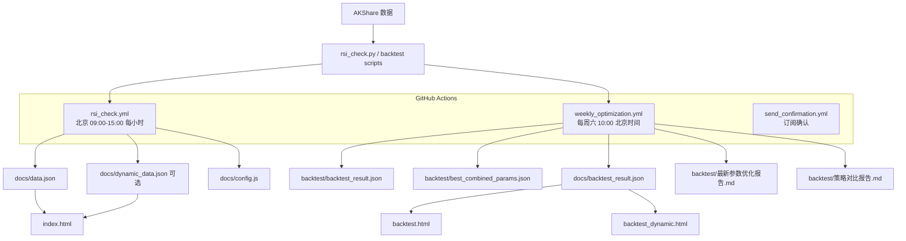

# 📈 JTrading - RSI 策略与动态阈值回测项目

[](https://github.com/Pear56/JTrading/actions/workflows/rsi_check.yml)
[](https://github.com/Pear56/JTrading/actions/workflows/weekly_optimization.yml)
[](https://github.com/Pear56/JTrading/actions/workflows/send_confirmation.yml)
[](https://pear56.github.io/JTrading/)
[](https://opensource.org/licenses/MIT)

JTrading 是一个基于 GitHub Actions 的自动化量化研究项目，围绕红利低波 ETF (512890) 提供：

- 交易时段小时级 RSI 信号更新（前端实时看板）
- 每周一次基础回测 + 动态参数优化
- 自动生成回测结果与 Markdown 报告

在线页面: https://pear56.github.io/JTrading/

---

## 当前数据快照（以仓库最新结果为准）

数据来源: `backtest/backtest_result.json`（`meta.generated_at = 2026-03-18 13:49:20`）

- 标的: 红利低波ETF (512890)
- 区间: 2019-01-18 到 2026-03-16
- 交易日: 1731
- 自然日: 2614

| 策略 | 总收益 | 年化收益 | 最大回撤 | 交易次数 | 胜率 |
|:--|--:|--:|--:|--:|--:|
| RSI+波动率 动态调优 | 320.27% | 22.20% | 13.11% | 13 | 100.00% |
| RSI(15) 固定阈值基线 (32/77) | 268.32% | 19.97% | 13.11% | 8 | 100.00% |
| 买入持有 (512890) | 140.04% | 13.01% | 16.57% | 0 | 0.00% |

对照资产（同区间）:

- 黄金ETF (518880): 总收益 279.37%，年化 20.46%
- 纳指ETF (159941): 总收益 255.91%，年化 19.39%
- 沪深300ETF (510300): 总收益 79.10%，年化 8.48%
- 标普500ETF (513500): 当前结果缺失（字段为 null）

说明:

- 页面与文档中的数字均应以 `backtest_result.json` 最新字段为准。
- 标普500数据已在回测脚本中加入失败兜底逻辑，但当无历史可用值时仍会为空。

---

## 核心策略

### 1) 固定阈值 RSI 基线

- RSI 周期: 15
- 平滑: EMA
- 买入条件: RSI < 32
- 卖出条件: RSI > 77

### 2) RSI + 波动率动态阈值

动态参数（最新）:

- `rsi_period`: 15
- `rsi_buy_base`: 34
- `rsi_sell_base`: 71
- `vol_window`: 55
- `k_vol`: -0.423847
- `vol_anchor`: 15.0

动态阈值:

$$
Buy = rsi\_buy\_base - k\_{vol} \cdot (Vol - vol\_anchor)
$$

$$
Sell = rsi\_sell\_base + k\_{vol} \cdot (Vol - vol\_anchor)
$$

其中波动率采用对数收益率滚动标准差年化:

$$
Vol = \operatorname{StdDev}\!\left(\ln\frac{P_t}{P_{t-1}},\;window\right)\sqrt{252}\times 100
$$

---

## 自动化架构


```mermaid
flowchart TD
    A[AKShare 数据] --> B[rsi_check.py / backtest scripts]

    subgraph GH[GitHub Actions]
        C[rsi_check.yml\n北京 09:00-15:00 每小时]
        D[weekly_optimization.yml\n每周六 10:00 北京时间]
        E[send_confirmation.yml\n订阅确认]
    end

    B --> C
    B --> D

    C --> F[docs/data.json]
    C --> G[docs/dynamic_data.json 可选]
    C --> H[docs/config.js]

    D --> I[backtest/backtest_result.json]
    D --> J[backtest/best_combined_params.json]
    D --> K[docs/backtest_result.json]
    D --> L[backtest/最新参数优化报告.md]
    D --> M[backtest/策略对比报告.md]

    F --> N[index.html]
    G --> N
    K --> O[backtest.html]
    K --> P[backtest_dynamic.html]
```

---

## 页面说明

- `docs/index.html`: 小时级 RSI 信号看板（含动态阈值/波动率更新时间）
- `docs/backtest.html`: 周度回测快照（固定阈值与动态策略对比）
- `docs/backtest_dynamic.html`: 动态策略专题页

---

## 项目结构

```text
JTrading/
├── .github/workflows/
│   ├── rsi_check.yml
│   ├── weekly_optimization.yml
│   └── send_confirmation.yml
├── backtest/
│   ├── rsi_backtest.py
│   ├── combined_optimization.py
│   ├── generate_markdown_reports.py
│   ├── backtest_result.json
│   ├── best_combined_params.json
│   ├── 最新参数优化报告.md
│   └── 策略对比报告.md
├── docs/
│   ├── index.html
│   ├── backtest.html
│   ├── backtest_dynamic.html
│   ├── data.json
│   ├── dynamic_data.json
│   ├── backtest_result.json
│   └── config.js
├── github_action_runner.py
├── send_confirmation.py
└── requirements.txt
```

---

## 本地运行

```powershell
pip install -r requirements.txt

# 基础回测
python backtest/rsi_backtest.py

# 动态优化
python backtest/combined_optimization.py

# 生成报告
python backtest/generate_markdown_reports.py
```

---

## 风险提示

本项目仅用于研究与工程实践展示，不构成投资建议。

- 历史回测不代表未来表现
- 参数优化存在过拟合风险
- 实盘需计入交易成本、滑点与执行时延

---

## 许可证

[MIT License](https://opensource.org/licenses/MIT)
